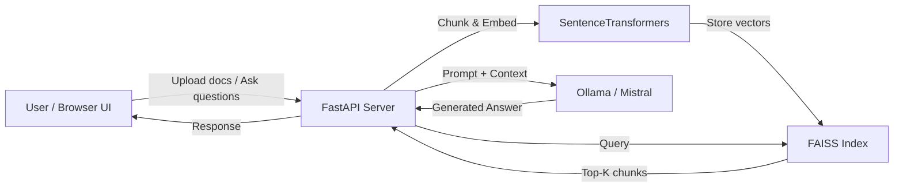

# RAG System — FastAPI + FAISS + SentenceTransformers + Ollama/Mistral

Build a fully-functional, production-quality Retrieval-Augmented Generation (RAG) system that lets users upload documents, embed & index them with FAISS, and ask natural-language questions answered by a local Mistral LLM via Ollama.

## User Review Required

> [!IMPORTANT]
> **Ollama must be installed** on your machine with the `mistral` model pulled (`ollama pull mistral`). The system will call `http://localhost:11434` by default.

> [!IMPORTANT]
> **Frontend included** — a sleek, dark-themed web UI will be served by FastAPI so you can interact with the RAG system from your browser without needing a separate frontend server.

## Architecture Overview



## Proposed Changes

### Project Structure

```
rag-system/
├── app/
│   ├── __init__.py
│   ├── main.py              # FastAPI app, lifespan, CORS, static mount
│   ├── config.py             # Pydantic Settings (env-based config)
│   ├── models.py             # Pydantic request/response schemas
│   ├── services/
│   │   ├── __init__.py
│   │   ├── embedder.py       # SentenceTransformer wrapper
│   │   ├── vectorstore.py    # FAISS index manager (add / search / persist)
│   │   ├── chunker.py        # Recursive text chunking
│   │   └── llm.py            # Ollama HTTP client (async)
│   ├── routers/
│   │   ├── __init__.py
│   │   ├── documents.py      # POST /api/documents  (upload & ingest)
│   │   └── query.py          # POST /api/query      (ask questions)
│   └── utils/
│       ├── __init__.py
│       └── file_parsers.py   # Extract text from .txt, .pdf, .md
├── static/                   # Frontend assets
│   ├── index.html
│   ├── style.css
│   └── app.js
├── data/
│   ├── uploads/              # Uploaded raw files
│   └── index/                # Persisted FAISS index + metadata
├── requirements.txt
├── .env.example
└── README.md
```

---

### Core Backend

#### [NEW] `app/config.py`
- Pydantic `Settings` class reading from `.env`
- Keys: `EMBEDDING_MODEL`, `OLLAMA_BASE_URL`, `OLLAMA_MODEL`, `CHUNK_SIZE`, `CHUNK_OVERLAP`, `TOP_K`, `FAISS_INDEX_PATH`, `UPLOAD_DIR`

#### [NEW] `app/models.py`
- `QueryRequest` / `QueryResponse` — question in, answer + sources out
- `DocumentUploadResponse` — upload status + chunk count
- `HealthResponse`

#### [NEW] `app/main.py`
- FastAPI app with lifespan event (loads embedder + FAISS index on startup)
- Mounts `static/` directory for the frontend
- Includes routers for `/api/documents` and `/api/query`
- Health-check endpoint `/api/health`

---

### Services

#### [NEW] `app/services/embedder.py`
- Wraps `sentence_transformers.SentenceTransformer`
- Default model: `all-MiniLM-L6-v2` (fast, 384-dim)
- `encode(texts: list[str]) -> np.ndarray`

#### [NEW] `app/services/vectorstore.py`
- Manages a `faiss.IndexFlatIP` (inner-product / cosine after normalization)
- Stores metadata (chunk text, source filename, chunk index) in a parallel Python list, persisted as JSON
- Methods: `add_documents()`, `search()`, `save()`, `load()`

#### [NEW] `app/services/chunker.py`
- Recursive character text splitter with configurable `chunk_size` and `chunk_overlap`
- Returns `list[dict]` with `text`, `metadata` (source, index)

#### [NEW] `app/services/llm.py`
- Async HTTP client calling Ollama's `/api/generate` endpoint
- Streams response tokens back
- Configurable system prompt with RAG instructions ("answer only from context")

---

### Routers

#### [NEW] `app/routers/documents.py`
- `POST /api/documents` — accepts file upload (`.txt`, `.pdf`, `.md`)
- Parses → chunks → embeds → adds to FAISS → persists index
- Returns chunk count and document metadata

#### [NEW] `app/routers/query.py`
- `POST /api/query` — accepts `{ "question": "..." }`
- Embeds question → FAISS similarity search → builds prompt with top-K context → calls Ollama → returns answer + source chunks

---

### Frontend (Served as Static Files)

#### [NEW] `static/index.html`
Premium, dark-themed single-page UI with:
- **Document upload panel** — drag-and-drop zone + file list
- **Chat interface** — message bubbles, typing indicator
- **Source citations** — expandable cards showing retrieved chunks

#### [NEW] `static/style.css`
- Dark glassmorphism design with gradient accents
- Smooth animations & micro-interactions
- Responsive layout (mobile-friendly)
- Google Font: Inter

#### [NEW] `static/app.js`
- Vanilla JS handling file uploads, chat messages, API calls
- Streaming-style answer display

---

### Utilities

#### [NEW] `app/utils/file_parsers.py`
- `parse_txt()`, `parse_md()` — reads plain text
- `parse_pdf()` — uses `PyPDF2` to extract text from PDFs

---

### Configuration & Docs

#### [NEW] `requirements.txt`
```
fastapi
uvicorn[standard]
sentence-transformers
faiss-cpu
python-multipart
httpx
PyPDF2
python-dotenv
pydantic-settings
numpy
```

#### [NEW] `.env.example`
```
EMBEDDING_MODEL=all-MiniLM-L6-v2
OLLAMA_BASE_URL=http://localhost:11434
OLLAMA_MODEL=mistral
CHUNK_SIZE=500
CHUNK_OVERLAP=50
TOP_K=5
```

#### [NEW] `README.md`
- Setup instructions, prerequisites (Ollama + Mistral), usage guide

## Open Questions

> [!IMPORTANT]
> 1. **Do you already have Ollama installed?** If not, I'll include installation steps in the README.
> 2. **PDF support** — should I include PDF parsing (adds `PyPDF2` dependency), or is `.txt` / `.md` sufficient?
> 3. **Streaming responses** — would you like the LLM answer to stream token-by-token to the UI, or is a single response acceptable for the first version?

## Verification Plan

### Automated Tests
1. Start the server with `uvicorn app.main:app --reload`
2. Upload a sample `.txt` document via the UI or curl
3. Ask a question about the document content
4. Verify the answer references the correct document chunks

### Manual Verification
- Open `http://localhost:8000` in the browser and test the full flow end-to-end
- Verify FAISS index persists across server restarts
